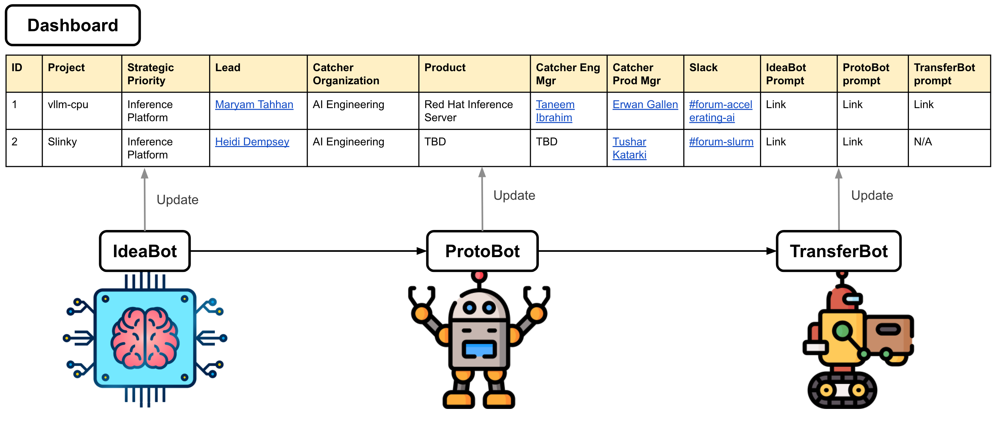

# Hermes



**Hermes** is our new Agent First approach to the Emerging Technologies Playbook. Why Hermes? In the greek pantheon, Hermes was the fastest and the most effective at diffusing a message (new technology that Red Hat needs to respond to) between the realms. 

## Overview ##

Note: This is an initial take to get us started. We can add new agents and change how the agents reflected work. I just wanted something concrete to lay out a vision that we could iterate on.

The process is comprised of 3 agents that have specific tasks and a Dashboard that serves as a single pane of glass for insight across the activities of all 3 agents. The dashboard allows our stakeholders to understand what is in-flight and negates the need for outbound communications on status.  Each agent has a defined set of input criteria and a defined set of output criteria and these form the interface contracts.

**IdeaBot** provides a UI for users to submit new ET project ideas. It asks follow up questions, reviews and decides whether we should proceed with the idea. IdeaBot will stage decisions and a Human-in-the-loop (HIL) will provide a final review on approving the idea for execution or moving it to the backlog.

**ProtoBot** takes the context from successful ideas from IdeaBot, and extends that context with a prompt to allow users to add specificity around how the idea is to be implemented and then generates a prototype. I would imagine this would incorporate something like SpecKit and possibly Agent Teaming. The user (HIL) will review the output artifacts before moving forward with the automated execution steps. The output of ProtoBot will be 
- The code and infrastructure artifacts
- Automated email summary to the catcher list (obtained from IdeaBot)
- Automated scheduled calendar meeting with the catchers for a transfer decision checkpoint
- Automated blog post describing the work

**TransferBot** takes the output of ProtoBot and the user extends that context with a prompt with directions to transfer the code and infrastructure artifacts into the Agentic Product Engineering and Business Unit systems. We'll need to meet with AI Eng and the AI BU to understand how these work and then back into a prompt that enables a successful transfer.

## Quick Start

### Prerequisites

- Python 3.10+
- Git

### Setup

1. Clone the repository:
```bash
git clone https://github.com/redhat-et/hermes.git
cd hermes
```

2. Create virtual environment:
```bash
python3 -m venv venv
source venv/bin/activate  # On Windows: venv\Scripts\activate
```

3. Install dependencies:
```bash
pip install -r requirements.txt
```

4. Run the server:
```bash
python app.py
```

5. Open your browser to http://localhost:8000

### Project Structure

```
hermes/
├── app.py                 # FastAPI application
├── templates/             # Jinja2 HTML templates
├── static/               # CSS, JavaScript, images
├── mocks/                # Mock data for UI development
├── agents/               # AI agent implementations (Phase 2+)
├── database.py           # Database layer (Phase 1+)
├── config.py             # Configuration (Phase 1+)
├── models.py             # Pydantic models (Phase 1+)
└── output/               # Generated artifacts (gitignored)
```

### Development Phases

See [TASKS.md](TASKS.md) for detailed implementation plan.

**✅ Phase 0 - UI Mockup (COMPLETE - 4 hours)**
- P0-001: Project scaffolding (FastAPI, Red Hat design system)
- P0-002: Base template with topbar and navigation
- P0-003: Static CSS (complete design system)
- P0-004: Dashboard page (project table, status badges)
- P0-005: IdeaBot page (11-question Q&A workflow)
- P0-006: ProtoBot page (8-phase execution tracking)
- P0-007: Chat panel UI (functional messaging)
- P0-008: Demo validation and documentation

**Deliverables:**
- Fully functional UI mockup with Red Hat branding
- 3 main pages: Dashboard (`/`), IdeaBot (`/ideabot/{id}`), ProtoBot (`/protobot/{id}`)
- Mock data integration from JSON files
- Interactive chat interface with auto-scroll
- Phase progress visualization
- Responsive design system

**Next Phase:** Phase 1 - Database & Core Backend (5.5 hours)

## Phase 0 Features

### Dashboard
- Project overview table with filtering
- Status badges: Approved, In Progress, Not Started, N/A
- Quick actions: View, Start, Continue buttons
- Real-time project count

### IdeaBot Page
- 11-question interview workflow
- Next/Show All navigation modes
- Contenteditable answer fields
- Pre-filled answers from `mocks/ideabot_vllm-cpu.json`
- AI evaluation card with decision + rationale
- Approval workflow to enable ProtoBot

### ProtoBot Page
- 8-phase progress bar (visual states: completed/active/pending)
- Phase 1: Research leads display (8 generated tasks)
- Phase 2: Research findings across 5 dimensions
- Chat panel for real-time ProtoBot interaction
- Two-column layout: phase content + chat
- Mock data from `protobot_vllm-cpu.json`

### Chat Interface
- Send/receive messages
- Auto-scroll to latest message
- Enter key sends (Shift+Enter for new line)
- Mock AI responses with random selection
- Pre-loaded chat history from `chat_responses.json`
- Message role indicators (user/assistant)

## Mock Data Structure

### projects.json
```json
[
  {
    "id": "vllm-cpu",
    "name": "vLLM CPU Platform",
    "lead": "Maryam Tahhan",
    "strategic_priority": "AI Inference Acceleration",
    "catcher_org": "AI Engineering",
    "ideabot_status": "approved",
    "protobot_status": "not_started"
  }
]
```

### ideabot_vllm-cpu.json
```json
{
  "project_id": "vllm-cpu",
  "answers": {
    "q1_name": "Maryam Tahhan",
    "q2_idea": "...",
    ...
  },
  "evaluation": {
    "decision": "approved",
    "rationale": "..."
  }
}
```

### protobot_vllm-cpu.json
```json
{
  "project_id": "vllm-cpu",
  "current_step": 1,
  "step1_research_leads": [...],
  "step2_research_findings": {...}
}
```

### chat_responses.json
```json
{
  "vllm-cpu": [
    {
      "role": "user",
      "content": "What's the status?"
    },
    {
      "role": "assistant",
      "content": "Research phase ready..."
    }
  ]
}
```

## Red Hat Design System

### Colors
- **Red Hat Red**: `#EE0000` - Primary brand, CTAs
- **Black**: `#151515` - Headings
- **Gray Scale**: `#1F1F1F`, `#6A6E73`, `#C7C9CA`, `#E5E5E5`, `#F5F5F5`
- **Status Colors**: Green `#3E8635`, Orange `#EC7A08`, Blue `#0066CC`

### Typography
- **Display**: Red Hat Display (headings)
- **Text**: Red Hat Text (body, UI)
- **Mono**: Red Hat Mono (code)

### Components
- Cards (header/body/actions)
- Buttons (primary/secondary/disabled)
- Badges (approved/in-progress/not-started/n/a)
- Tables with hover effects
- Progress bars
- Chat panels
- Form fields

