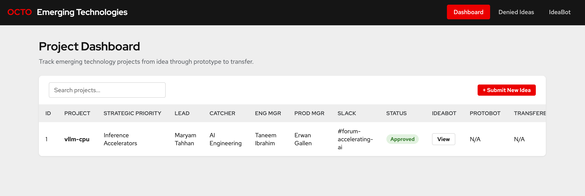

# IdeaBot Input #

In order to effectively evaluate an idea. IdeaBot needs the following input data:

- What is your name?
- What is the idea?
- What is the project name for your idea?
- Why do you think this is relevant to Red Hat’s current or future addressable market?
- Does this idea contribute towards an existing strategic priority for OCTO or Red Hat?
- In which product in the Red Hat Portfolio would these new capabilities land (the catcher)?
- Who is the catching Product Manager?
- What is the catching Engineering Manager?
- Who is the catching engineer with the most influence on the design approach that needs to be taken?
- Have you checked with members of the relevant catching engineering team and business unit that they are not already working on this idea?
- Have you had a discussion on the technical approach to take with the relevant catchers technical leads to address the problem or opportunity motivating the idea?

# Building Output #

In order for other agents and components to make use of the evaluation decision, IdeaBot will produce the following:

- Either an Approve or Deny decision
- Rationale supporting its decision
- Update the Dashboard with the data gathered during the decision making process

# Building IdeaBot #

1) Clone this folder into a directory that you've enabled to work with Claude
2) Edit the prompt.txt execution section at the end to reflect your vertex Project ID
3) Pass in the content in the prompt.txt to Claude and run it and it will build IdeaBot

It should look something like the example below

